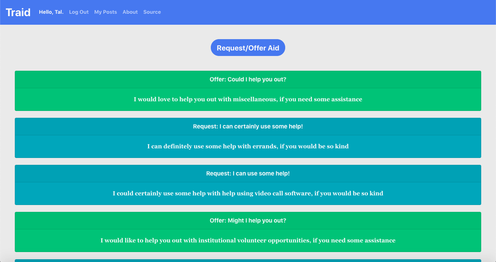

# Traid

### Video Presentation:

### Deployed Web App:

https://tr-aid.web.app

### Source:

https://github.com/equalithon-team-three/traid-frontend

### Description:

Responsive web app that allows users to offer and request aid from others in their community.

MVP completed using Agile methodologies in 7 days for the Essteem Hackathon for COVID-19 Relief sponsored by Girls Who Code, [in which it won first place](https://www.equalithon.io/past-challenges/traid).

### Tech Stack:

Built using Ruby, Ruby on Rails, and Active Record on the backend and React and Bootswatch on the frontend.

### Dev Team:

- Tal Luigi ([LinkedIn](https://www.linkedin.com/in/talluigi) | [GitHub](https://github.com/luigilegion))
- Graham Troyer-Joy ([LinkedIn](https://www.linkedin.com/in/grahamtroyerjoy) | [GitHub](https://github.com/telegraham))
- Meredith Strickland ([LinkedIn](https://www.linkedin.com/in/meredith-strickland) | [GitHub](https://github.com/merestrickland))
- Jessica Lin ([LinkedIn](https://www.linkedin.com/in/lin-jessica) | [GitHub](https://github.com/lin-jessica))

### Schema:

    Users ----< Posts >-------- PostCategory
                  |                  |
                  |                  |
                  |                  ^
                  |             Taggability
                  |                 \/
                  |                  |
                  |                  |
                  |            TagCategories
                  |                  |
                  |                  |
                  |                  |
                  |                  |
                  |                  ^
                  ----------------< Tags

### Heroku Deployment:

1. Set up the [Heroku command line tools](https://devcenter.heroku.com/articles/heroku-cli)
2. Authenticate using `heroku login`
3. Add a git remote for heroku:

- **If you are creating a new app...**

  1. `heroku create` or `heroku create YOUR-APP-NAME` if you have a name in mind
  2. `heroku addons:create heroku-postgresql:hobby-dev` to add ("provision") a PostgreSQL database to your heroku dyno

- **If you already have a Heroku app...**

  `heroku git:remote YOUR-APP-NAME`

- **If you changed migrations...**

  `heroku run rake db:migrate`

- **If migrating doesn't update your table columns...**

  1. `heroku pg:reset` to reset your provisioned PostgreSQL database
  2. `heroku run rake db:schema:load` to create the tables in your provisioned PostgreSQL database using /db/schema.rb

- **If you want to seed your provisioned PostgreSQL database...**

  `heroku run rake db:seed` to seed your provisioned PostgreSQL database using /db/seeds.rb

- **If you want to manually deploy your local master branch to your Heroku app...**

  `git push heroku master`

- **If you want to manually deploy another local branch to your Heroku app...**

  `git push heroku LOCAL-BRANCH-NAME:master` or `git push --force heroku LOCAL-BRANCH-NAME:master`
